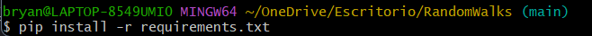

# Pseudo-random tester

This program test the pseudo-random number generate with [PseudoRandomNumberGenerator](https://github.com/brayooo/PseudoRandomNumberGenerator).
The project implements 5 tests: test of means, test of variance, KS test, Chi2 test and Poker test.

### For use the program you should follow the next steps:
## Clone the Project

1. Go to your desktop or an empty folder and right-click to display the pop-up 
   menu where you will select the "Open Git Bash here" option. 
     
     

    

2. In the terminal, type the following command:

    `git clone https://github.com/brayooo/PseudoRandomNumberTests.git`
    And wait for it to finish cloning the entire project from the repository

3. When you finish cloning, the project folder should appear.

    

## Install required Python Libraries

If you are using windows you better use a **bash** terminal or if
you already have the configuration done of your windows cmd to works
with python, go ahead.

### Let's check that pip is installed
- Open a **bash** into the project and type:

    

      > pip show pip
    
    If you have it installed, you should see general information about this library. Like this:
    
    

    If nothing comes out, you must install pip.

    
- Install requirements:

      > pip -r install requirements.txt
    
    
    
    ### Now you're up to use the project.

## Running the Project

- Open the project with the **IDE** or **Development Environment** you want.
- You'll see the main.py file.
- You can run the file with the command
      
      > python main.py

- Or you can run the file using the run configuration of your IDE.

Perfect, if everything goes well and if you followed the steps you can see the user interface,
you're ready to use the program to test pseudo-random numbers.

          

To test pseudo-numbers you have to click the `Load files` button, select the file and then press the `Run all Tests` button.

## Important

The program only allows .json files, if you want to use other type of files, you must convert the file and 
use this structure:

## Author

- Bryan Lopez

**Simulación de Computadores - Grupo 1**